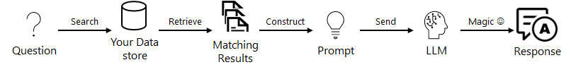

# Generative AI Workshop: From Concept to Creation

## Workshop Description

### Target Audience
Developers proficient in Python or JavaScript.

### Workshop Objectives
- Understand the fundamentals of Generative AI technology and its applications.
- Develop a Generative AI solution using Python or JavaScript.
- Experiment with various AI prompting techniques.
- Implement Retrieval Augmented Generation (RAG) to enhance AI responses with external data.
- Build a scalable AI agent capable of performing specific tasks.
- Learn to estimate and manage the computational costs associated with running AI solutions.

By completing this workshop, you'll gain the skills needed to tackle advanced development challenges in the field of Generative AI.

## Additional Resources
For more detailed information about the APIs used in this workshop, refer to the [OpenAI Platform Documentation](https://platform.openai.com/docs/overview).

## Scenario Story
You've recently joined the development team at NovelReads, a thriving online bookstore with a broad range of titles and a dedicated reader community. Despite the success in sales, customer inquiries regarding book recommendations, availability, and order status updates have surged, leading to a bottleneck in customer service responses.

The challenge lies in enhancing customer experience without compromising service quality. As the latest addition to the team, your mission is to design and implement a Generative AI customer support agent on the NovelReads platform. This AI should not only address common queries efficiently but also provide personalized book recommendations, thereby reducing the workload on human agents and ensuring customer satisfaction.

## Lab Description:
### Step 1: Chat Completion
Set up a basic chat interface using the OpenAI API to send prompts and receive responses. This step establishes the foundation for building more complex AI interactions.

**Tasks Accomplished:**
- Set up API key configuration for OpenAI.
- Send a basic user prompt to the model.
- Receive and display the model's response.

<details>
<summary><strong>Python Code Example</strong></summary>

```python
import openai

# Set your OpenAI API key
openai.api_key = 'your-api-key'

response = openai.ChatCompletion.create(
  model="gpt-3.5-turbo",
  messages=[
      {"role": "system", "content": "You are a helpful AI."},
      {"role": "user", "content": "I'm looking for a book recommendation."}
  ]
)

print(response['choices'][0]['message']['content'])
```

</details>

<details>
<summary><strong>JavaScript Code Example</strong></summary>

```javascript
const { Configuration, OpenAIApi } = require("openai");

const configuration = new Configuration({
  apiKey: process.env.OPENAI_API_KEY,
});
const openai = new OpenAIApi(configuration);

async function chatCompletion() {
  try {
    const response = await openai.createChatCompletion({
      model: "gpt-3.5-turbo",
      messages: [
        { role: "system", content: "You are a helpful AI." },
        { role: "user", content: "I'm looking for a book recommendation." }
      ]
    });
    console.log(response.data.choices[0].message.content);
  } catch (error) {
    console.error(error);
  }
}

chatCompletion();
```

</details>

### Step 2: Scrape and Vectorize Data
This step involves scraping web content and creating a vector database from the content. You will scrape paragraphs from a website and vectorize each paragraph to create a searchable vector database.

**Tasks Accomplished:**
- Fetch and parse HTML content from a URL.
- Extract paragraphs as text from the HTML content.
- Convert each paragraph into a vector using OpenAI's embedding API.
- Store each paragraph and its vector in a structured format.

<details>
<summary><strong>Python Code Example</strong></summary>

```python
import requests
from bs4 import BeautifulSoup
import openai

# Scrape content from a URL
def scrape_content(url):
    response = requests.get(url)
    soup = BeautifulSoup(response.text, 'html.parser')
    paragraphs = [p.text for p in soup.find_all('p')]
    return paragraphs

# Send paragraphs to OpenAI for vectorization and store them in the desired format
def vectorize_paragraphs(paragraphs):
    vector_data = []
    for paragraph in paragraphs:
        vector_response = openai.Embedding.create(
            input=paragraph,
            model="text-embedding-ada-002"
        )
        vector = vector_response['data'][0]['embedding']
        vector_data.append({'paragraph': paragraph, 'embedding': vector})
    return vector_data

# Example URL
url = "https://www.novelreads.com/latest-releases"
paragraphs = scrape_content(url)
vector_data = vectorize_paragraphs(paragraphs)
```

</details>

<details>
<summary><strong>JavaScript Code Example</strong></summary>

```javascript
const axios = require('axios');
const cheerio = require('cheerio');

async function scrapeContent(url) {
  const { data } = await axios.get(url);
  const $ = cheerio.load(data);
  const paragraphs = $('p').map((i, el) => $(el).text()).get();
  return paragraphs;
}

async function vectorizeParagraphs(paragraphs) {
  const vectorData = [];
  for (let paragraph of paragraphs) {
    // Simulate vectorization (actual API call needed)
    const vector = { paragraph: paragraph, embedding: "vector_placeholder" };
    vectorData.push(vector);
  }
  return vectorData;
}

const url = "https://www.novelreads.com/latest-releases";
scrapeContent(url).then(paragraphs => {
  vectorizeParagraphs(paragraphs).then(vectorData => {
    console.log(vectorData);
  });
});

```

</details>

### Step 3: Connect To Your Data (RAG)
In this step, use the previously created vector database to enhance the AI’s responses. The AI will query the vector database for context relevant to the user’s queries, dynamically adjusting its responses accordingly.



**Tasks Accomplished:**
- Query the vector database for the most relevant paragraph based on the user's input.
- Utilize the retrieved paragraph to inform and contextualize the AI’s response.

<details>
<summary><strong>Python Code Example</strong></summary>

```python
import openai

# Function to fetch relevant context from vector database
def get_relevant_context(query, vector_data):
    # Example function that simulates fetching the most relevant paragraph
    return vector_data[0]['paragraph']  # Simplified example

# Retrieve relevant data to add context
relevant_context = get_relevant_context("latest bestsellers", vector_data)

response = openai.ChatCompletion.create(
  model="gpt-3.5-turbo",
  messages=[
      {"role": "system", "content": f"You are a helpful AI. {relevant_context}"},
      {"role": "user", "content": "Tell me about the latest bestsellers."}
  ]
)

print(response['choices'][0]['message']['content'])
```
</details>

<details>
<summary><strong>JavaScript Code Example</strong></summary>

```javascript
async function getRelevantContext(query, vectorData) {
  // Simulated function to fetch most relevant paragraph
  return vectorData[0].paragraph; // Simplified example
}

// Assume 'vectorData' is available and has the structure [{paragraph: 'text', embedding: [vector]}]
const relevantContext = getRelevantContext("latest bestsellers", vectorData);

// Simulate response from AI with the relevant context
console.log(`AI Response: You asked about ${relevantContext}`);
```

</details>

### Step 4: Managing Chat History
Implement in-memory storage to manage chat history during an active session, allowing the AI to utilize previous interactions for better context and response personalization without the overhead of database operations.

**Tasks Accomplished:**
- Use object to store chat sessions, keeping them accessible during the server runtime.
- Ensure that the chat history is leveraged in real-time to enhance the AI's responses.

<details>
<summary><strong>Python Code Example</strong></summary>

```python
import openai

# Dictionary to store chat history, where keys are session_ids and values are lists of messages
chat_history = {}

def save_chat(session_id, messages):
    """Save chat messages in memory."""
    if session_id not in chat_history:
        chat_history[session_id] = []
    chat_history[session_id].extend(messages)

def get_chat_history(session_id):
    """Retrieve chat history from memory."""
    return chat_history.get(session_id, [])

def generate_response(session_id, user_input):
    """Generate AI response using chat history and current input."""
    history = get_chat_history(session_id)
    history.append({'role': 'user', 'content': user_input})
    response = openai.ChatCompletion.create(
        model="gpt-3.5-turbo",
        messages=history,
        temperature=0.7
    )
    # Save the new user input and AI response to history
    save_chat(session_id, [{'role': 'user', 'content': user_input}, {'role': 'assistant', 'content': response.choices[0].message['content']}])
    return response.choices[0].message['content']

# Example usage
session_id = 'session_123'
user_input = 'What’s the best ride for thrill-seekers?'
print(generate_response(session_id, user_input))

```

</details>

<details>
<summary><strong>JavaScript Code Example</strong></summary>

```javascript
const { Configuration, OpenAIApi } = require("openai");

// Object to store chat history, where keys are session_ids and values are lists of messages
const chatHistory = {};

function saveChat(sessionId, messages) {
    /** Save chat messages in memory. */
    if (!chatHistory[sessionId]) {
        chatHistory[sessionId] = [];
    }
    chatHistory[sessionId].push(...messages);
}

function getChatHistory(sessionId) {
    /** Retrieve chat history from memory. */
    return chatHistory[sessionId] || [];
}

async function generateResponse(sessionId, userInput) {
    /** Generate AI response using chat history and current input. */
    const history = getChatHistory(sessionId);
    history.push({role: 'user', content: userInput});
    const configuration = new Configuration({apiKey: process.env.OPENAI_API_KEY});
    const openai = new OpenAIApi(configuration);

    const response = await openai.createChatCompletion({
        model: "gpt-3.5-turbo",
        messages: history,
        temperature: 0.7
    });
    // Save the new user input and AI response to history
    saveChat(sessionId, [{role: 'user', content: userInput}, {role: 'assistant', content: response.data.choices[0].message.content}]);
    return response.data.choices[0].message.content;
}

// Example usage
const sessionId = 'session_123';
const userInput = 'What’s the best ride for thrill-seekers?';
generateResponse(sessionId, userInput).then(console.log);

```

</details>

### Step 5: Exposing the Chat as a REST API
Develop a REST API to expose the in-memory chat functionality, allowing external applications to interact with the AI chat system through HTTP requests.

**Tasks Accomplished:**
- Set up a web server using Flask or Express.
- Define endpoints for initiating a chat session and sending messages.
- Implement request handling to interact with the chat system and return responses.

<details>
<summary><strong>Python Code Example</strong></summary>

```python
from flask import Flask, request, jsonify
import openai

app = Flask(__name__)

# Dictionary to store chat history
chat_history = {}

@app.route('/chat', methods=['POST'])
def chat():
    data = request.json
    session_id = data.get('session_id')
    user_input = data.get('message')
    
    if session_id not in chat_history:
        chat_history[session_id] = []
    
    history = chat_history[session_id]
    history.append({'role': 'user', 'content': user_input})
    
    response = openai.ChatCompletion.create(
        model="gpt-3.5-turbo",
        messages=history,
        temperature=0.7
    )
    
    # Save response
    chat_history[session_id].append({'role': 'assistant', 'content': response.choices[0].message['content']})
    
    return jsonify({'response': response.choices[0].essage['content']})

if __name__ == '__main__':
    app.run(debug=True, port=5000)

```

</details>

<details>
<summary><strong>JavaScript Code Example</strong></summary>

```javascript
const express = require('express');
const { Configuration, OpenAIApi } = require("openai");
const bodyParser = require('body-parser');

const app = express();
app.use(bodyParser.json());

const chatHistory = {};
const configuration = new Configuration({apiKey: process.env.OPENAI_API_KEY});
const openai = new OpenAIApi(configuration);

app.post('/chat', async (req, res) => {
    const { sessionId, message } = req.body;
    
    if (!chatHistory[sessionId]) {
        chatHistory[sessionId] = [];
    }

    const history = chatHistory[sessionId];
    history.push({role: 'user', content: message});

    const response = await openai.createChatCompletion({
        model: "gpt-3.5-turbo",
        messages: history,
        temperature: 0.7
    });

    // Save response
    chatHistory[sessionId].push({role: 'assistant', content: response.data.choices[0].message.content});

    res.json({response: response.data.choices[0].message.content});
});

const PORT = 3000;
app.listen(PORT, () => {
    console.log(`Server is running on port ${PORT}`);
});

```

</details>